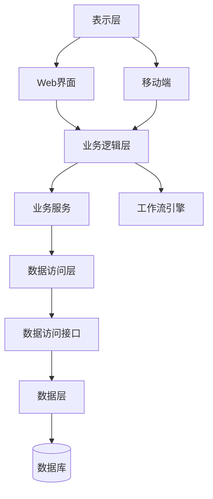

# Mermaid 图表生成指南

## 方法 1：在线编辑器（推荐，最简单）

1. 访问 https://mermaid.live/
2. 输入以下代码：



3. 点击 Actions → Download PNG/SVG
4. 保存到 `src/main/docs/asciidoc/images/chapter01/system-architecture.png`

## 方法 2：使用 mermaid-cli

```bash
# 安装 mermaid-cli
npm install -g @mermaid-js/mermaid-cli

# 创建 mermaid 代码文件
cat > architecture.mmd << 'EOF'
flowchart TD
    UI[表示层]
    UI --> WEB[Web界面]
    UI --> MOBILE[移动端]

    BIZ[业务逻辑层]
    WEB --> BIZ
    MOBILE --> BIZ
    BIZ --> SERVICE[业务服务]
    BIZ --> WORKFLOW[工作流引擎]

    DAO[数据访问层]
    SERVICE --> DAO
    DAO --> API[数据访问接口]

    DATA[数据层]
    API --> DATA
    DATA --> DB[(数据库)]
EOF

# 生成图片
mmdc -i architecture.mmd -o src/main/docs/asciidoc/images/chapter01/system-architecture.png
```

## 方法 3：使用 mermaid.ink API

直接使用图片 URL（需要联网）：
```
https://mermaid.ink/img/pako:eNqVVtuOmzAQ_ISfJq8hS3u6rIEBqQD2oEikYdYtENIWZM2fO0lkIrYf_dcxKJSlWdHnfOnRk7ec2ZmQQfwJiPHcCbr4UWZS2lkXZUhSlM7sVTz8vtPd49ztWbnK4sFJTXAtd0C4RZ71EH2UiWYWLFcLUkoET7PUMFG4rnmX0Lc7qJJIfhE1mWQoKJ3EXM6aJ7h9pNHjQVBPQLNmV4WqY7MvhEBYYQ7gI41mUJDNELGdpeSN9FidQUDJb5SLh6i2aJIlwQdyLY3u6Msk5zFQWmQ4G8q7TrtS15cSnKKQuULeAywhCOdIKW4WxJQiBHzNFBbN55xyMgWf1NqrwnHqZRtjWgYhBKVSSWrYWPFcyoIprKYXaVdeEYCVVXQyX0Y8jPUmUuJS4UUvuPJt0bpbJZOzL6VnFHORUxc4msR4pcRlMvylY5NlnLtbVKxcHE1rTTcI69U1rPtF3hGTF9lHI97Q31RbDN5iHj56IhGf0nbSfUubW1tPwFYzsY4?type=png)
```
